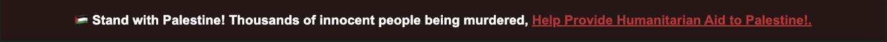

# Support Palestine

This is an repository that include code snippet for websites, that helps you create a "Support Palestine" Badge.

The link is dynamic and can be changed to any link you want, but the current link redirect to a donation page.

## Web


You can paste the following html code at the top of the `<body>` tag of your website to show the badge.

```html
<div
  style="
        padding: 16px;
        display: absolute;
        top: 0;
        left: 0;
        width: 100wh;
        background-color: rgb(38, 22, 22);
        color: white;
        font-family: Arial, Helvetica, sans-serif;
        font-weight: bold;
        font-size: 20px;
        box-shadow: 2px 2px 2px rgba(0, 0, 0, 0.198);
        text-align: center;
      "
>
  <div
    style="
          display: flex;
          align-items: center;
          justify-content: space-between;
          flex-wrap: wrap;
        "
  >
    <p style="margin: 0; flex-grow: 2">
      🇵🇸 Stand with Palestine! Thousands of innocent people being murdered,
      <a
        style="color: rgb(183, 56, 56)"
        href="https://bit.ly/save-palestine-code"
        >Help Provide Humanitarian Aid to Palestine!.</a
      >
    </p>
  </div>
</div>
```
